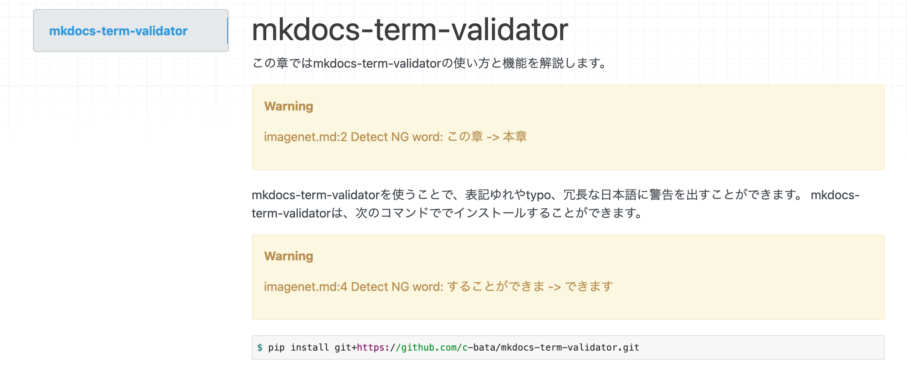

# mkdocs-term-validator

mkdocs port of https://github.com/shimizukawa/sphinx-term-validator



## Installation

```
$ pip install git+https://github.com/c-bata/mkdocs-term-validator.git
```

## Usage

```yaml
# mkdocs.yml
plugins:
    - term-validator:
        rule_dic_file: ng-word.txt
```

## License

The source code is released under [Apache License 2.0](./LICENSE) except for `example-rule-dic.txt` derived from https://github.com/shimizukawa/sphinx-term-validator

